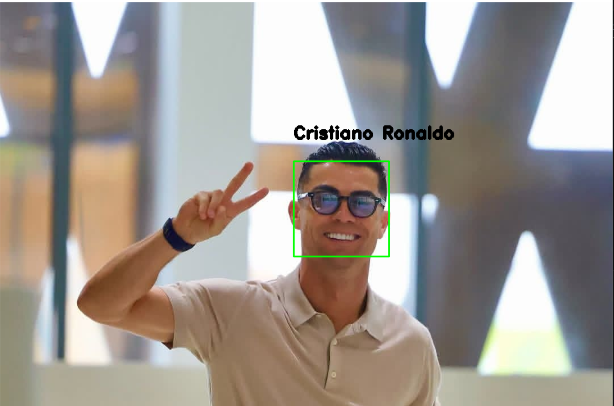

👋 Welcome to my OpenCV Learning Journey!
Hi, I'm Dania! I am currently learning OpenCV with Python. I'm at the beginning of my journey, mastering the basics and aiming to become a Computer Vision expert. My goals include securing a Master’s scholarship and working at top-tier tech companies.
I share my code along with visual results to track my progress. If you find my work helpful or have any advice to share, I’d love to connect!
📩 Connect with me on LinkedIn:[Dania's profile](https://www.linkedin.com/in/dana-dana-250894407)
My Pandas&NumPy project:[Pandas&NumPy](https://github.com/20danaai/Learn_LibrariesPy)
Note: If you find these scripts helpful, feel free to give this repo a Star ⭐️! It helps me stay motivated.
If you want to see the best project i've done : 

