# OpenCV Learning Journey 🚀

Welcome to my computer vision learning repository. This project showcases various image processing techniques implemented using Python and the OpenCV library.

---

## 📂 Project Structure & Features

### 1. Basic Functions (Basic_Function/)
Core image processing techniques including:
* Grayscale Conversion: 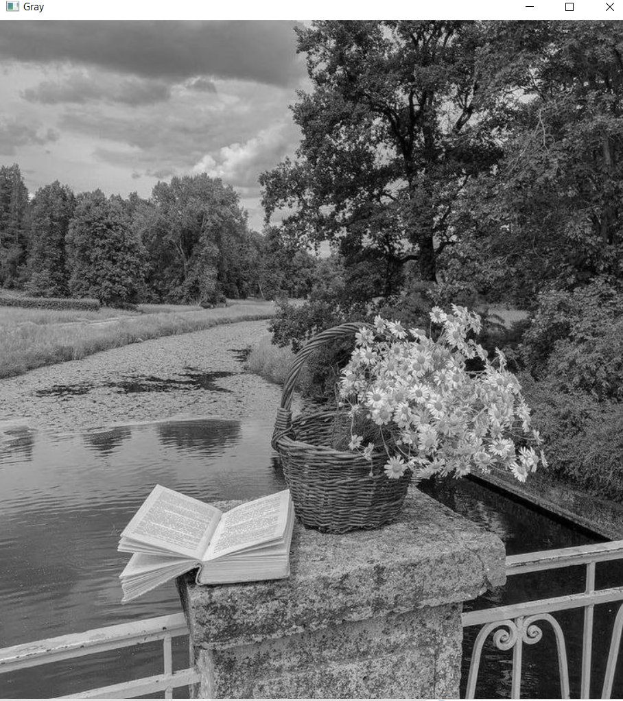
* Blurring: 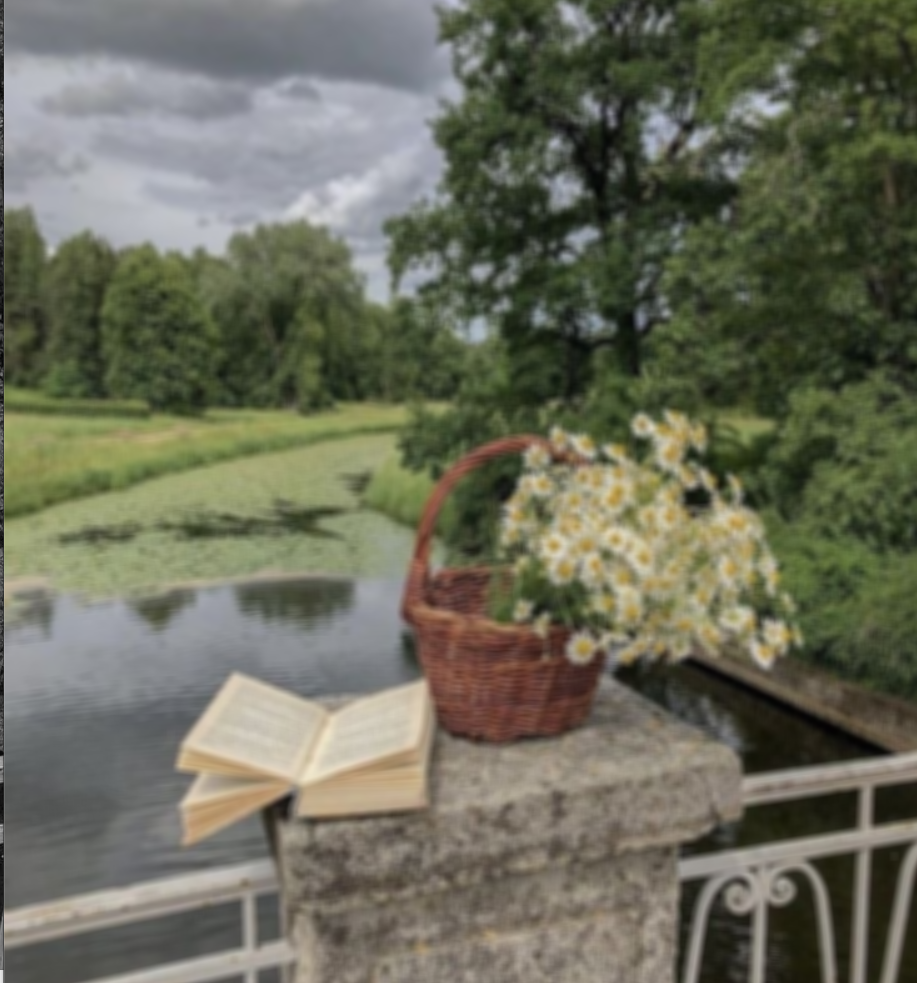
* Edge Detection: 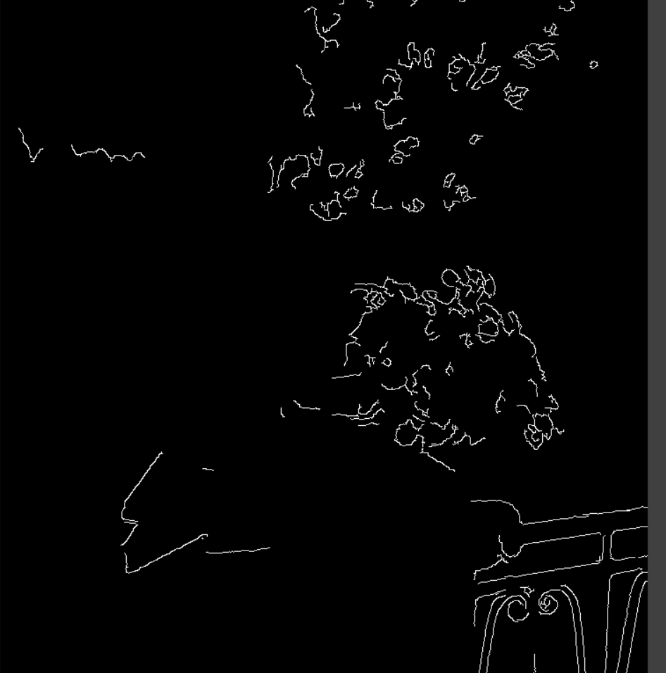
* Dilation & Erosion: 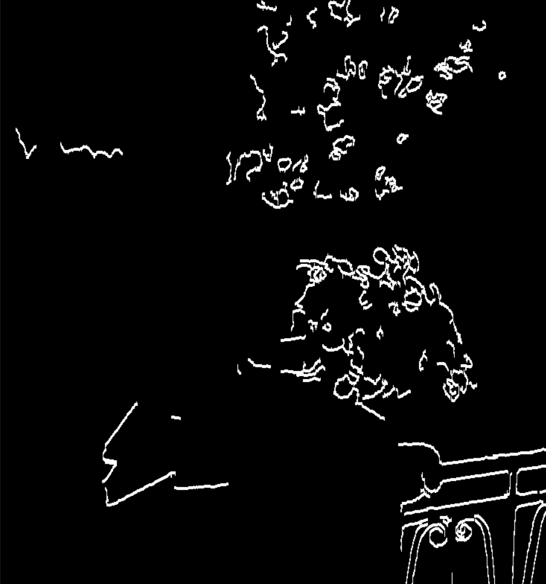 & 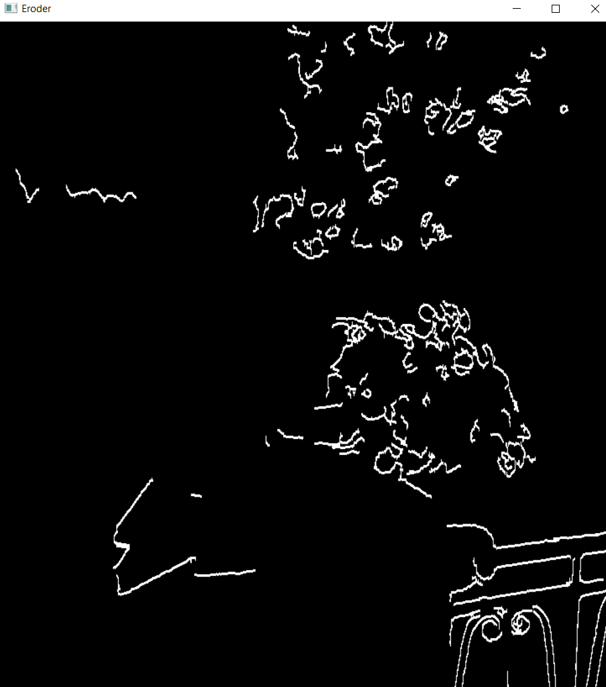

### 2. Geometric Transformations (05_Translation/ & 02_Rescale/)
* Translation: 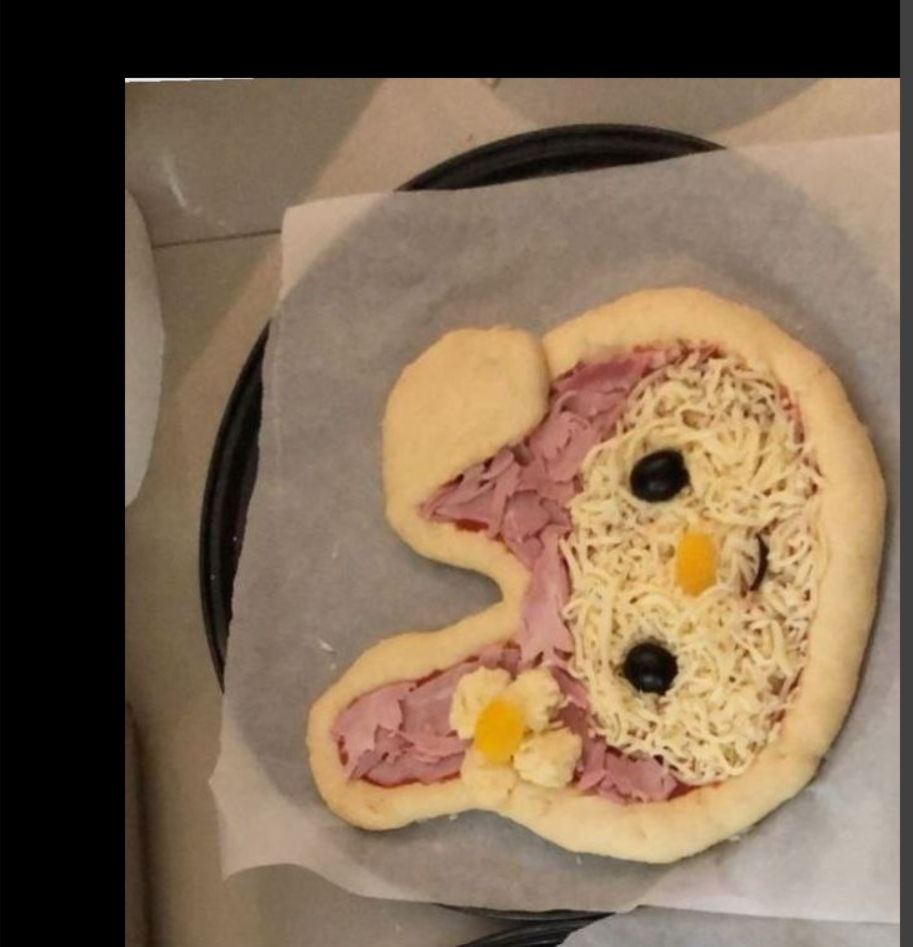
* Rotation: 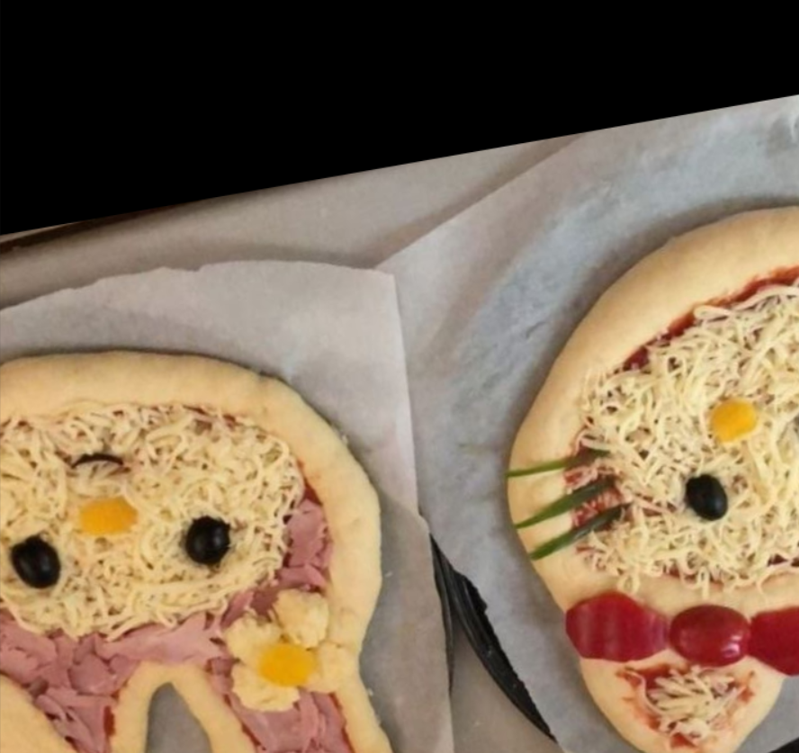
* Flipping: 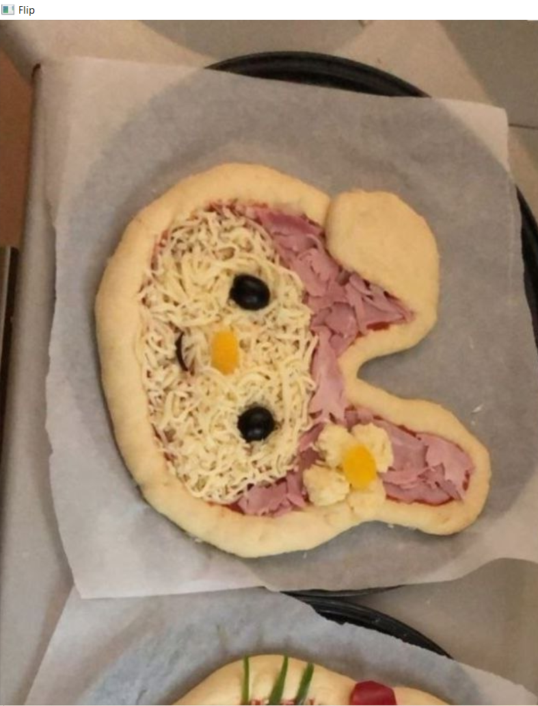
* Resizing: 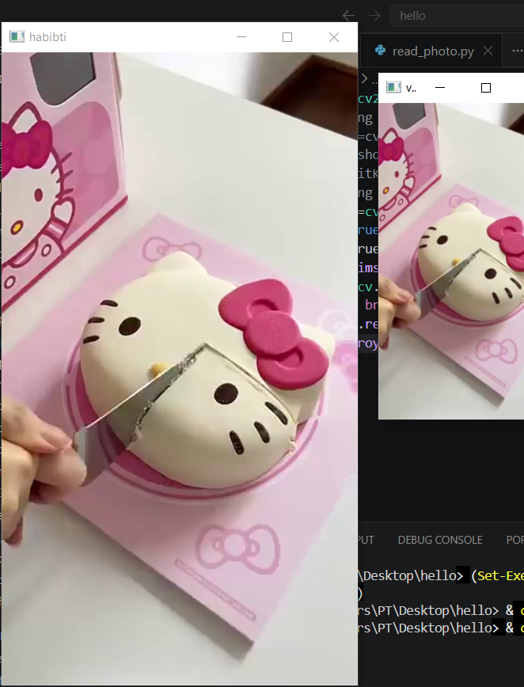 & 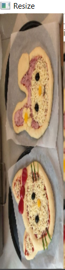

### 3. Drawing and Shapes (draw_and_line/)
* Custom Text: 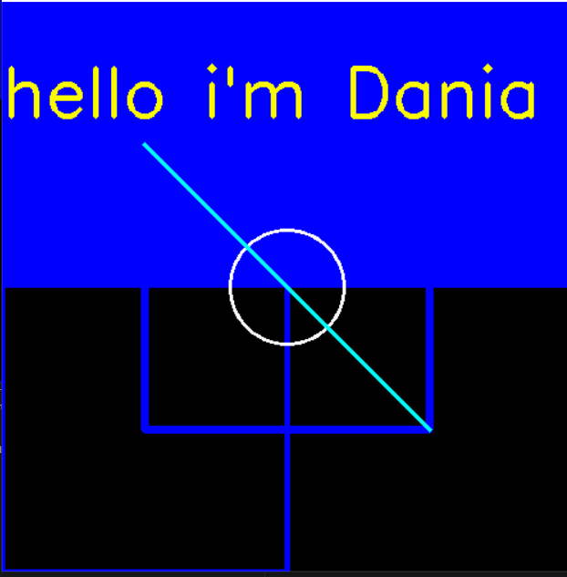
* Shapes: 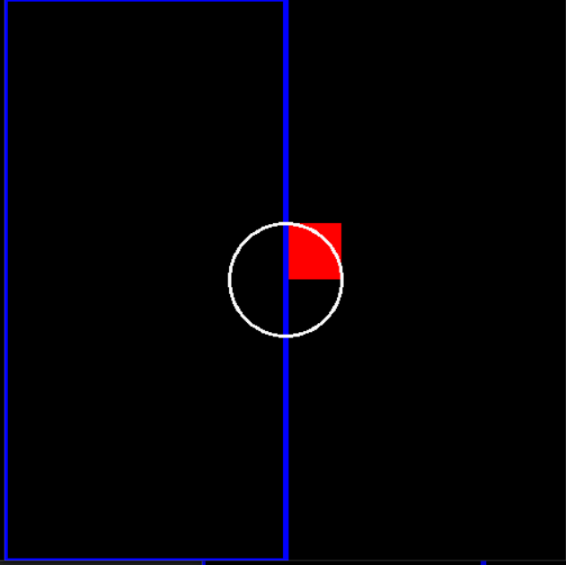

## 📸 Visual Gallery

| Feature | Result Preview |
| :--- | :--- |
| Canny Edges |  |
| Flipped Image |  |
| Rotated Image |  |
| Custom Text |  |
| Shapes |  |

---

## 🛠️ How to Run
1. Install OpenCV: pip install opencv-python
2. Run any script, for example:
   `bash
   python Basic_Function/basic.py
